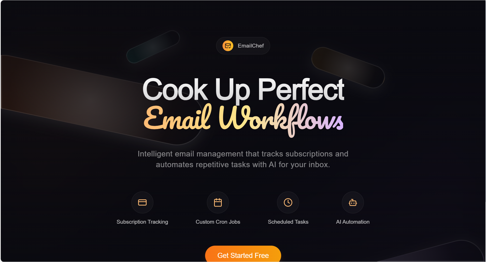

[](https://www.getinboxzero.com)

<p align="center">
  <a href="https://email-chef.vercel.app/">
    <h1 align="center">EmailChef - AI Email Assistant</h1>
  </a>
  <p align="center">
    Open source email automation and subscription tracking via emails.
    <br />
    <a href="https://email-chef.vercel.app/">Website</a>
    ·
    <a href="#">Discord</a>
    ·
    <a href="#">Issues</a>
  </p>
</p>

## About

There are three parts to EmailChef:

1. An AI email assistant that helps you automate your email.
2. Open source email subscription tracker tool (builds a timeline of your paid subscriptions).
3. Advanced AI workflow using convex workflow engine.

Deploy with a single click.

[](https://vercel.com/new/clone?repository-url=https%3A%2F%2Fgithub.com%2Femee-dev%2Femail-chef&env=UNIPILE_API_TOKEN,UNIPILE_DSN,UNIPILE_NOTIFY_URL,UNIPILE_SUCCESS_REDIRECT_URL,CONVEX_DEPLOYMENT,NEXT_PUBLIC_CONVEX_URL&envDescription=Unipile%20API%20Token%2CUnipile%20DSN%20endpoint%2CUnipile%20Notify%20Webhook%20URL%2CUnipile%20Success%20Redirect%20URL%2CConvex%20Deployment%20ID%2CConvex%20Public%20URL)

## Features

- **AI Personal Assistant:** Manages your email for you based on a plain text prompts. It can take any action a human assistant can take on your behalf (Label, Reply).
- **Smart Categories:** Categorize your emails.
- **Cold Email Blocker:** Automatically block (trash) cold emails.
- **Email Analytics:** Track your email activity with daily, weekly, and monthly stats.

## Demo

[](#)

[Chef link](https://chef.show/e8c7f4)

[Vercel deployment](https://email-chef.vercel.app/)

## Built with

- [Next.js](https://nextjs.org/)
- [Tailwind CSS](https://tailwindcss.com/)
- [shadcn/ui](https://ui.shadcn.com/)
- [Convex chef](https://www.prisma.io/)
- [Convex](https://convex.dev/)
- [Convex Workflows](https://www.convex.dev/components/workflow)
- [Google Gemini](https://aistudio.google.com/apikey)

### Contributing to the project

I am not accepting contributions at this moment.

[ARCHITECTURE.md](./ARCHITECTURE.md) explains the architecture of the project (LLM generated).

### Requirements

- [Node.js](https://nodejs.org/en/) >= 18.0.0
- [pnpm](https://pnpm.io/) >= 8.6.12

### Setup

The external services that are required are:

- [Unipile](https://unipile.com)

You also need to set an LLM, but you can use a local one too:

- Google Gemini

We use Convex for the database.

### Environment variables

Set the environment variables in the`.env.local`. You can see a list of required variables in: `.env.example`.

The required environment variables:

### Unipile

- `UNIPILE_API_TOKEN`  
  Can be copied from the [Unipile dashboard](https://dashboard.unipile.com/access-tokens).
- `UNIPILE_DSN`  
  Can be copied from the Unipile dashboard. It is in the form of `apixxx.xxxx.xxx`.
- `UNIPILE_NOTIFY_URL`: Unipile hosted auth webhook URL.
- `UNIPILE_SUCCESS_REDIRECT_URL`: URL to redirect after successful Unipile authentication.
- `UNIPILE_NOTIFY_URL`: (can be the same as `UNIPILE_SUCCESS_REDIRECT_URL` just base URL without paths).

### Convex

- `NEXT_PUBLIC_CONVEX_URL`  
  Can be copied from the Convex dashboard.
- `CONVEX_DEPLOYMENT`
- `CONVEX_DEPLOY_KEY`

### Gemini

- `GOOGLE_GENERATIVE_AI_API_KEY`  
  Obtain from [Google AI Studio](https://aistudio.google.com/apikey).

To sync your functions to convex:

```bash
pnpm convex dev
```

To run the app locally for development:

```bash
pnpm run dev
```

### Overview of Architecture
